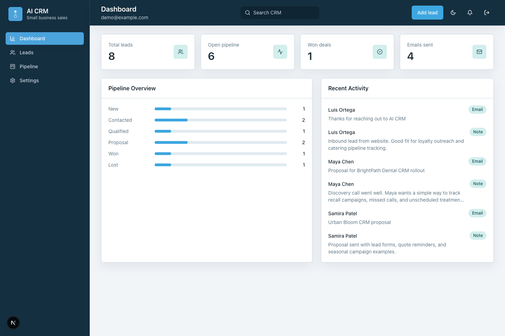
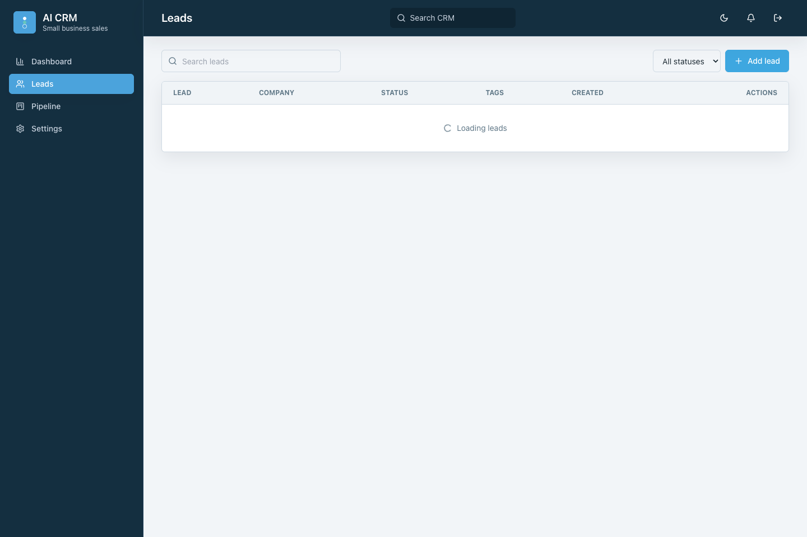
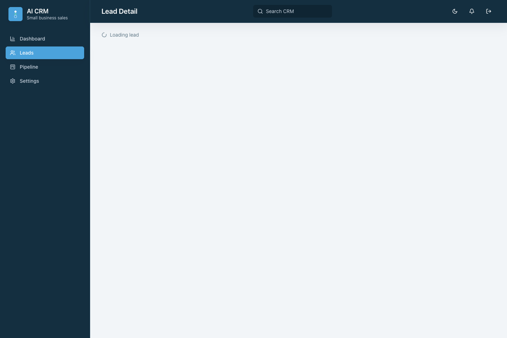
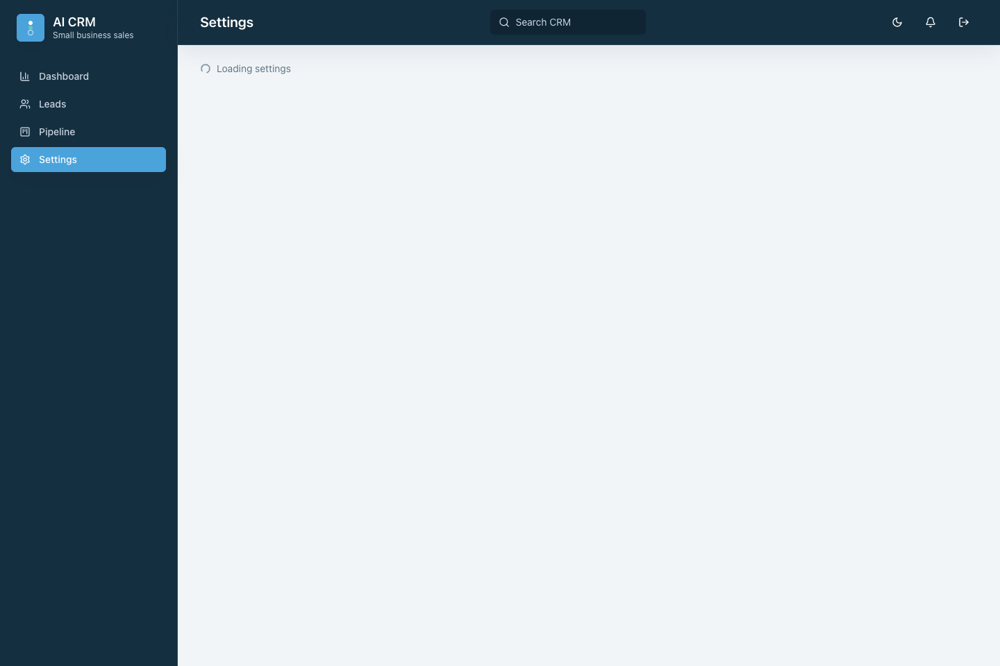
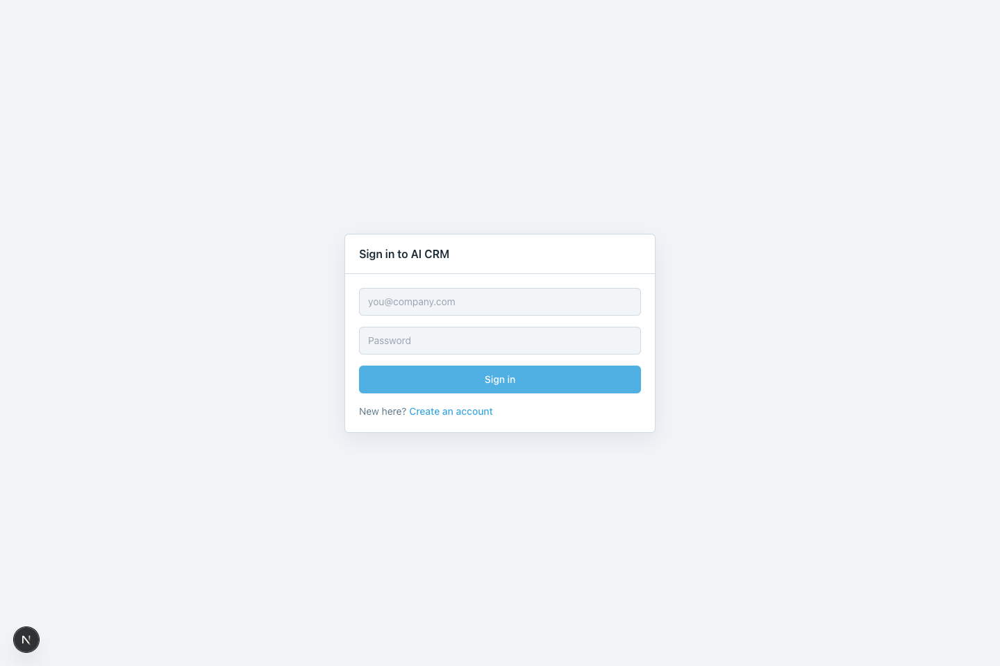
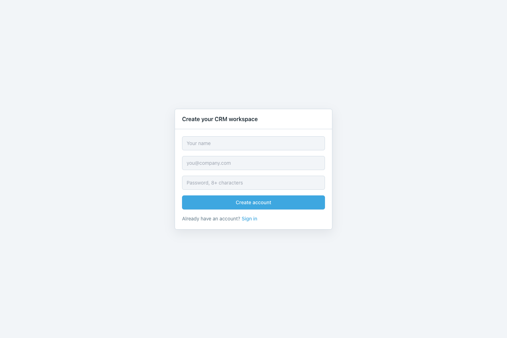

# AI CRM for Small Businesses

A full-stack SaaS CRM built with Next.js App Router, TypeScript, Tailwind, Prisma, PostgreSQL, NextAuth, Groq AI, and Resend.

## Setup

1. Install dependencies: `npm install`
2. Copy `.env.example` to `.env` and set `DATABASE_URL` plus `NEXTAUTH_SECRET`.
3. Start Postgres: `docker compose up -d postgres`
4. Run Prisma: `npm run prisma:migrate`
5. Start dev server: `npm run dev`

Groq and Resend keys can be set globally in `.env` or per user from the Settings page.

## Screenshots

### Dashboard

### Leads

### Lead Detail

### Pipeline

### Settings

### Login

### Register

